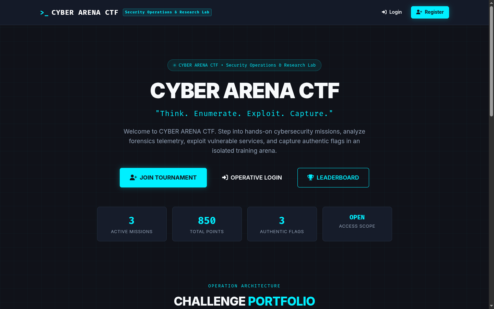
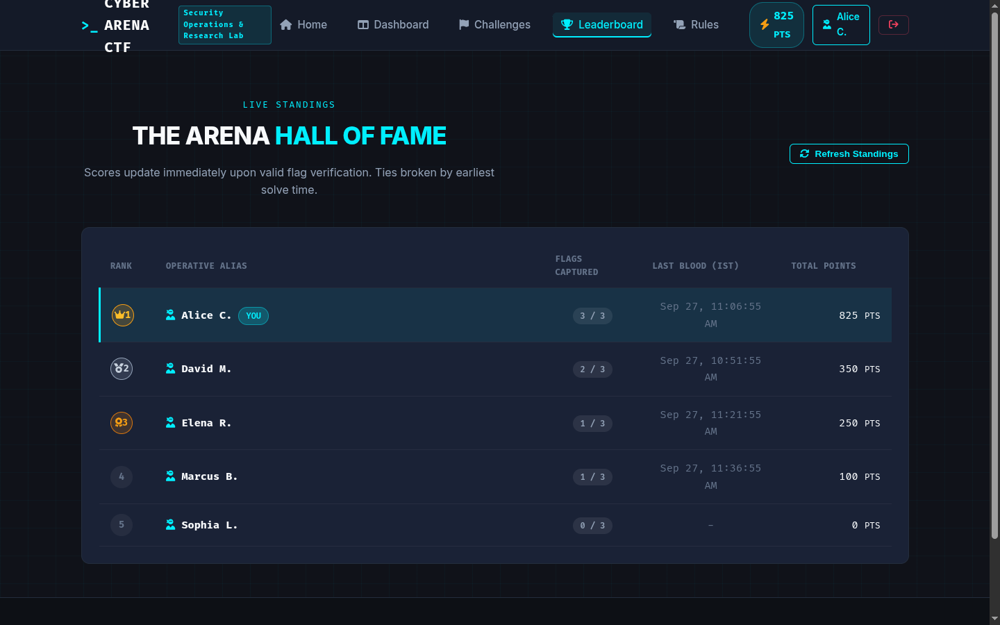
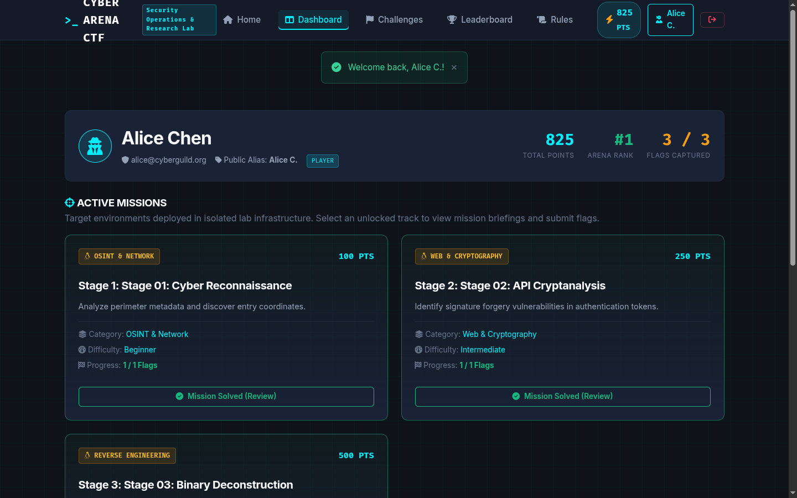
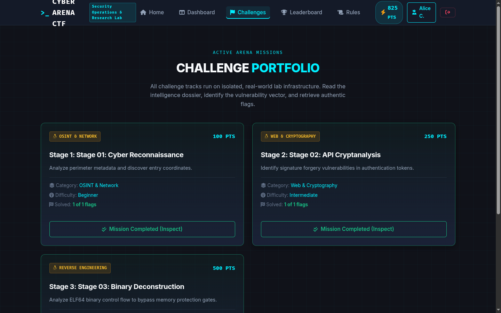
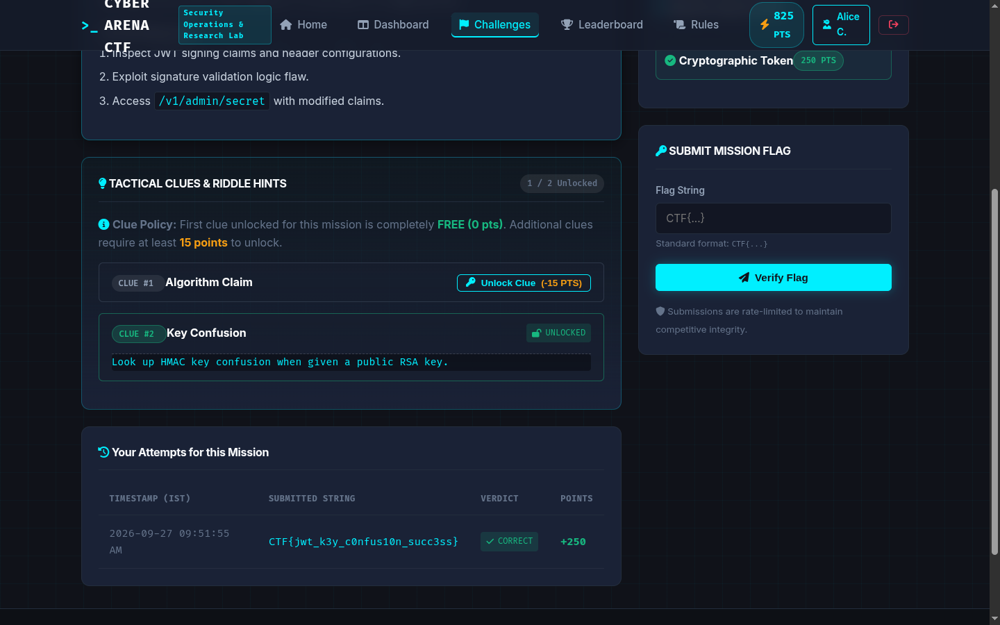
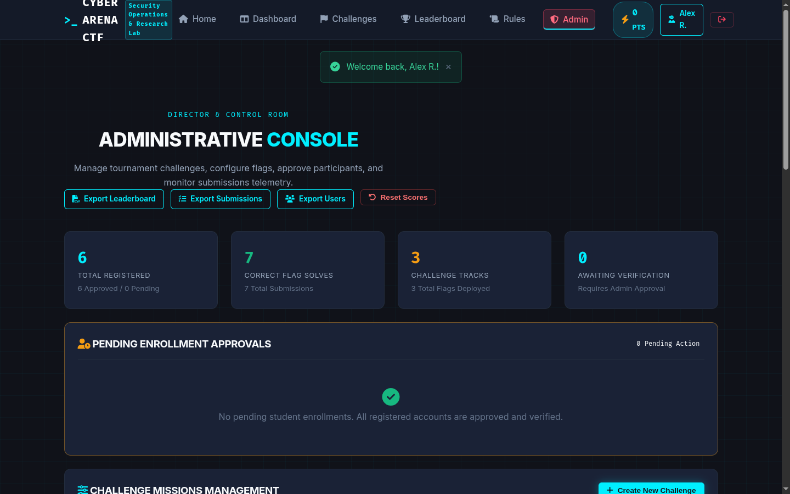

# CTF Portal Template

<p align="center">
  
  
  
  
  
  
</p>

A generic, production-ready, highly configurable Capture The Flag (CTF) portal template built with Flask, SQLAlchemy, TailwindCSS, PostgreSQL, and Docker.

Designed to be cloned, customized, and deployed for any academic, corporate, or community security competition in minutes without modifying backend code.

---

## Interface Preview & Gallery

| Landing Page | Live Leaderboard |
| :---: | :---: |
|  |  |

| Operative Dashboard | Challenges Grid |
| :---: | :---: |
|  |  |

| Mission Dossier & Clue Unlock | Admin Command Center |
| :---: | :---: |
|  |  |

---

## Features

- **Dynamic Competition Engine**: Zero hardcoded challenges or events. All metadata is managed via `config/event.json` and the web Admin Panel.
- **Challenge & Flag Management**: Full CRUD interface for challenges, multiple flags per challenge (exact or case-insensitive), hints with point penalties, tags, and difficulty tiers.
- **Sequential Stage Locking**: Option to enforce linear progression (Stage 2 unlocks only after Stage 1 is completed).
- **Domain-Restricted or Open Registration**: Restrict signups to corporate/university domains (`@example.edu`) or leave open for public competitions.
- **Participant Vetting**: Optional admin approval toggle for registered participants before they appear on leaderboards or access challenges.
- **Live Leaderboard**: Real-time scoring, solve timestamps formatted in 12-hour IST (or configured timezone), and automatic tie-breaking based on earliest solve times.
- **Anti-Bruteforce & Security**: Rate-limited login and submission endpoints, Argon2id/Scrypt password hashing, CSRF protection, and audit logging.
- **Export & Backups**: 1-click CSV export of participant dossiers, solve logs, and database backup scripts.
- **Docker-Ready**: Instant multi-container stack (PostgreSQL + Gunicorn Web + Nginx) with automated health checks.

---

## Table of Contents

1. [Requirements](#requirements)
2. [Project Structure](#project-structure)
3. [Quick Start](#quick-start)
4. [Environment Configuration](#environment-configuration)
5. [Event Configuration](#event-configuration)
6. [Database Setup & Initialization](#database-setup--initialization)
7. [Creating an Admin Account](#creating-an-admin-account)
8. [Configuring Allowed Email Domains](#configuring-allowed-email-domains)
9. [SMTP & Email Verification](#smtp--email-verification)
10. [Admin Guide: Creating Challenges & Flags](#admin-guide-creating-challenges--flags)
11. [Scoring & Leaderboard Rules](#scoring--leaderboard-rules)
12. [Backups & Tournament Reset](#backups--tournament-reset)
13. [Production Deployment](#production-deployment)
14. [Troubleshooting](#troubleshooting)

---

## Requirements

### For Docker Deployment (Recommended)
- **Docker Engine**: >= 20.10.0
- **Docker Compose**: >= 2.0.0
- **System Memory**: 2 GB RAM minimum
- **Disk Space**: 5 GB free disk space

### For Native Python Deployment
- **Python**: 3.10, 3.11, or 3.12
- **PostgreSQL**: 14+ (or SQLite for local development)
- **libpq-dev** & **gcc** (for building `psycopg2`)

---

## Project Structure

```text
CTF-Portal-Template/
├── backend/
│   ├── app.py                 # Core Flask application & routes
│   ├── config.py              # Environment configuration loader
│   ├── models.py              # SQLAlchemy database schema
│   ├── email_service.py       # Transactional verification mailer
│   ├── create_admin.py        # CLI admin user generator
│   ├── reset_competition.py   # CLI score/data reset utility
│   ├── requirements.txt       # Python dependencies
│   └── entrypoint.sh          # Container bootstrap script
├── config/
│   └── event.example.json     # Event metadata, branding, and rules template
├── database/
│   ├── schema.sql             # Pure PostgreSQL DDL definitions
│   ├── init_db.py             # Schema initialization utility
│   └── seeds/                 # Optional developer seeds (empty by default)
├── docs/
│   ├── ARCHITECTURE.md        # Technical architecture & schema docs
│   └── DEPLOYMENT.md          # Multi-cloud & single-server deployment guide
├── frontend/
│   ├── static/
│   │   ├── css/ctf-theme.css  # Dark cyberpunk theme & styling
│   │   └── js/ctf-portal.js   # Dynamic UI interactions & animations
│   └── templates/             # Jinja2 HTML templates
│       ├── admin.html         # Admin management suite
│       ├── base.html          # Core layout wrapper
│       ├── challenges.html    # Challenge grid & card view
│       ├── dashboard.html     # Participant mission dashboard
│       ├── leaderboard.html   # Live score table
│       ├── login.html         # Authentication interface
│       ├── register.html      # Registration interface
│       ├── story.html         # Clue viewer & flag submission
│       └── ...
├── nginx/
│   └── default.conf           # Reverse proxy configuration
├── scripts/
│   ├── backup.sh              # Database automated backup script
│   └── setup.sh               # Quick installation & permission script
├── docker-compose.yml         # Container orchestration manifest
├── Dockerfile                 # Web container build recipe
├── .env.example               # Secrets & environment template
└── README.md                  # This file
```

---

## Quick Start

### 1. Initialize Configuration
```bash
cp .env.example .env
cp config/event.example.json config/event.json
```

Edit `.env` and set your secure passwords:
```bash
nano .env
```

### 2. Launch the Stack
```bash
docker compose up -d --build
```

### 3. Initialize Admin Account
Run the admin creation tool inside the running web container:
```bash
docker compose exec web python backend/create_admin.py --username admin --email admin@example.com --password "YourStrongPassword123!"
```

### 4. Access the Portal
Open your browser and navigate to:
- **Public Portal**: `http://localhost/` or `http://<your-server-ip>/`
- **Admin Panel**: `http://localhost/admin`

---

## Environment Configuration

Configure the `.env` file before launching:

| Variable | Description | Example / Default |
| :--- | :--- | :--- |
| `SECRET_KEY` | Flask session cookie secret | Random 32+ char hex string |
| `POSTGRES_DB` | Database name | `ctf_portal_db` |
| `POSTGRES_USER` | PostgreSQL user | `ctf_admin` |
| `POSTGRES_PASSWORD` | PostgreSQL password | `ChangeMeSecurely123!` |
| `DATABASE_URL` | SQLAlchemy connection string | `postgresql://ctf_admin:pass@db:5432/ctf_portal_db` |
| `ALLOWED_EMAIL_DOMAINS` | Allowed registration domains (blank = open) | `example.edu,corp.net` |
| `REQUIRE_NUMERIC_ROLL` | Require digits in email username | `false` |
| `REQUIRE_APPROVAL` | Require admin approval before competing | `true` |
| `SEQUENTIAL_STAGES` | Lock higher stages until prior completed | `true` |
| `SMTP_ENABLED` | Toggle email verification | `false` |
| `SMTP_HOST` | Outgoing SMTP mail server | `smtp.example.com` |
| `SMTP_PORT` | SMTP port | `587` |
| `SMTP_USER` | SMTP username | `notifications@example.com` |
| `SMTP_PASS` | SMTP password / App token | `smtp_password` |
| `SMTP_FROM` | Sender email address | `no-reply@example.com` |
| `BASE_URL` | Root URL used in verification links | `https://ctf.example.com` |

---

## Event Configuration

Customize competition branding and behavior in `config/event.json`:

```json
{
  "eventName": "CYBER QUEST 2026",
  "eventSubtitle": "Annual Security Assessment & Capture The Flag",
  "organization": "Security Guild",
  "contactEmail": "ctf-support@example.com",
  "registrationEnabled": true,
  "competitionActive": true,
  "allowedEmailDomains": [],
  "requireAdminApproval": true,
  "sequentialStages": true,
  "rateLimitWarning": "Notice: Excessive requests or automated bruteforcing will trigger automated rate limits.",
  "rules": [
    "Attacking portal infrastructure or fellow competitors is strictly prohibited.",
    "Do not share flags, solutions, or clues with other participants.",
    "Automated web directory fuzzers on the portal itself will lead to IP bans.",
    "Decisions made by tournament administrators are final."
  ]
}
```

---

## Database Setup & Initialization

When using Docker, the database initializes automatically on first boot via `backend/entrypoint.sh`.

### Manual Initialization (Native Python)
If running outside of Docker:
```bash
python3 -m venv venv
source venv/bin/activate
pip install -r backend/requirements.txt

# Initializes tables (PostgreSQL or fallback SQLite)
python backend/database/init_db.py
```

The database schema starts **completely empty**:
- 0 Challenges
- 0 Flags
- 0 Submissions
- 0 Scores

---

## Creating an Admin Account

Use the CLI helper to bootstrap administrative users:

```bash
# Non-interactive CLI
python backend/create_admin.py --username admin --email admin@example.com --password "SecureAdminPassword123!"

# Or interactive prompt
python backend/create_admin.py
```

In Docker:
```bash
docker compose exec web python backend/create_admin.py --username admin --email admin@example.com --password "SecurePassword123!"
```

---

## Configuring Allowed Email Domains

### 1. Restricted Signups (Campus / Corporate)
To restrict registration to specific institutions or corporate addresses, set:
```env
ALLOWED_EMAIL_DOMAINS=university.edu,student.university.edu
```
Anyone trying to register with `@gmail.com` or `@outlook.com` will be rejected with an informative error.

### 2. Open Public Registration
To allow any valid email address to register, leave the setting blank:
```env
ALLOWED_EMAIL_DOMAINS=
```

---

## SMTP & Email Verification

When `SMTP_ENABLED=true`, new registrants receive an activation email with a secure token:

```env
SMTP_ENABLED=true
SMTP_HOST=smtp.gmail.com
SMTP_PORT=587
SMTP_USER=myctfmailer@gmail.com
SMTP_PASS=app_specific_password_here
SMTP_FROM=no-reply@myctf.org
BASE_URL=https://ctf.myctf.org
```

*Note: If `SMTP_ENABLED=false`, verification tokens are printed to stdout / container logs, and the account can also be directly approved in `/admin`.*

---

## Admin Guide: Creating Challenges & Flags

1. Log in with your admin account and navigate to `/admin`.
2. Locate the **Create Challenge** section.
3. Fill in:
   - **Title**: Descriptive name of the challenge.
   - **Stage / Order**: Sequential order number (e.g., `1`, `2`, `3`). If `sequentialStages` is enabled, Stage 2 requires Stage 1 completion.
   - **Points**: Integer points awarded for solving (e.g., `100`, `250`).
   - **Category**: Category label (e.g., `Web Exploitation`, `Reverse Engineering`, `Forensics`, `Cryptography`).
   - **Difficulty**: `Easy`, `Medium`, `Hard`, or `Insane`.
   - **Description / Mission Brief**: Markdown-supported scenario, target instructions, and downloadable asset URLs.
4. Click **Create Challenge**.
5. Once created, click **Manage Flags & Hints** on the challenge card to add:
   - **Flag**: The secret string (e.g., `CTF{w3lc0m3_t0_th3_m4tr1x}`).
   - **Case Sensitive**: Match strictly or ignore casing.
   - **Hints**: Optional clues with optional point deductions.

---

## Scoring & Leaderboard Rules

- **First Solves**: Points are credited immediately upon submitting a valid flag.
- **Tie-Breaking**: If two participants have equal points, the user with the **earliest timestamp** on their highest-scoring solve ranks higher.
- **Sequential Stages**: When enabled, players cannot submit flags for Stage $N$ until Stage $N-1$ is solved.
- **Admin Approval**: If `requireAdminApproval` is enabled, only participants marked as **Approved** will appear on the public leaderboard.

---

## Backups & Tournament Reset

### Automated Database Backup
Execute the backup script:
```bash
./scripts/backup.sh
```
Backups are saved to `backups/ctf_backup_YYYYMMDD_HHMMSS.sql.gz`.

### Tournament Reset
To wipe participant scores or reset the event between rounds:
```bash
# Reset all scores, submissions, and unlocks while keeping users and challenges
python backend/reset_competition.py --scores-only

# Reset all non-admin users, submissions, and scores
python backend/reset_competition.py --all-players
```

---

## Production Deployment

For complete multi-server, TLS/SSL, and cloud deployment instructions, consult [docs/DEPLOYMENT.md](file:///home/shanawaz/CTF-Portal-Template/docs/DEPLOYMENT.md).

For architectural diagrams and schema specifications, consult [docs/ARCHITECTURE.md](file:///home/shanawaz/CTF-Portal-Template/docs/ARCHITECTURE.md).

---

## Troubleshooting

### Web container cannot connect to database
- Verify `POSTGRES_PASSWORD` in `.env` matches `DATABASE_URL`.
- Check database logs: `docker compose logs db`.

### Users are not receiving activation emails
- Verify SMTP host and port. For port `465` or `587`, ensure TLS/SSL requirements are met.
- If testing locally, set `SMTP_ENABLED=false` and approve users manually in `/admin`.

### Nginx shows 502 Bad Gateway
- Check if the web container is running: `docker compose ps`.
- Check Gunicorn application logs: `docker compose logs web`.

---

## License & Usage

This template is open-source and intended for educational, training, and defensive CTF competitions. Ensure you have proper authorization before hosting any security challenges.
